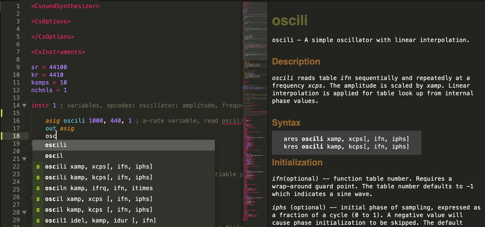

# SublimeCsound v1.1.0
A Sublime Text 4 Plugin that adds Csound support and documentation.

## About
This plugin uses syntax highlighting and completions from [CsoundST3](https://github.com/nikhilsinghmus/CsoundST3), 
and adds more build systems and an ide-like documentation window inspired by CsoundQt.

## Installation
Clone or download this repo into the Sublime Packages folder. 
This plugin should work on MacOS, Linux, and Windows. 
Clear the documentation cache after every update (see below).

## Usage
Syntax highlighting, completions, and build systems work as you'd expect.

To use the documentation:
1. Open your Csound file
2. Change to two columns (View -> Layout -> Columns: 2) (or cmd-alt-2)
3. Place your cursor within an opcode (e.g. oscili)
4. The documentation will appear in the second column
5. Click the links or page title to open them in the default webbrowser

The documentation is fetched from the web and cached. 
To clear the cache, use the command pallet to run the `Csound: Clear Documentation Cache` command.

## How it Works
When the user selects (or moves their cursor to) text with a scope of support.function.csound:
1. The current word is grabbed
2. A request is made to [http://www.csounds.com/manual/html/\<word\>.html]()
3. The html is wrangled to loosely fit sublime's minihtml spec
4. The links are updated and the title is turned into a link
5. csound.css style is added (which originally came from [http://www.csounds.com/manual/html/csound.css](http://www.csounds.com/manual/html/csound.css))
6. The resultant minihtml is displayed to the user in the second column

## What's New?
v1.1: Links work, made the page title a link, updated and fixed styles, fixed random characters in the build results 
v1.0: First version 
 
#BBB
