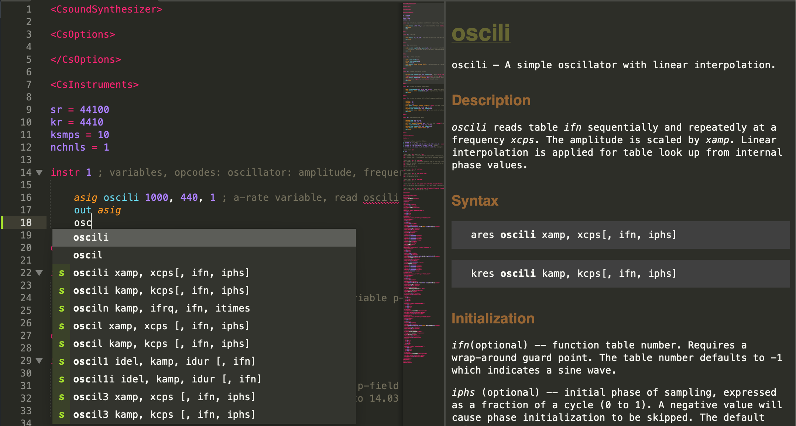

# SublimeCsound v1.0.0
A Sublime Text 4 Plugin that adds Csound support and documentation.

## About
This plugin uses syntax highlighting and completions from [CsoundST3](https://github.com/nikhilsinghmus/CsoundST3)
And adds more build systems and an ide-like documentation window inspired by CsoundQt.

## Installation
Clone or download this repo into the Sublime Packages folder.
This plugin should work on MacOS, Linux, and Windows.

## Usage
Syntax highlighting, completions, and build systems work as you'd expect.

To use the documentation:
1. Open your Csound file
2. Change to two columns (View -> Layout -> Columns: 2) (or cmd-alt-2)
3. Place your cursor within an opcode (e.g. oscili)

The documentation is fetched from the web and cached.
To clear the cache, use the command pallet to run the `Csound: Clear Documentation Cache` command.

## How it Works
When the user selects (or moves their cursor to) text with a scope of support.function.csound
1. The current word is grabbed
2. A request is made to [http://www.csounds.com/manual/html/<word>.html]()
3. The html is wrangled to loosely fit sublime's minihtml spec
4. csound.css style is added (which originally came from [http://www.csounds.com/manual/html/csound.css]()
5. The resultant minihtml is displayed to the user in the second column

## What's New?
v1.0: First version
